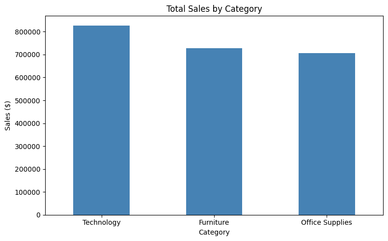
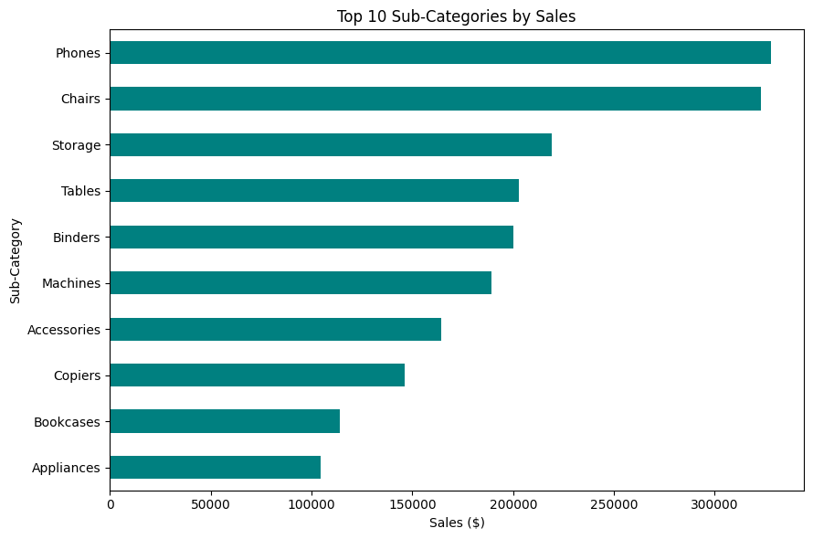
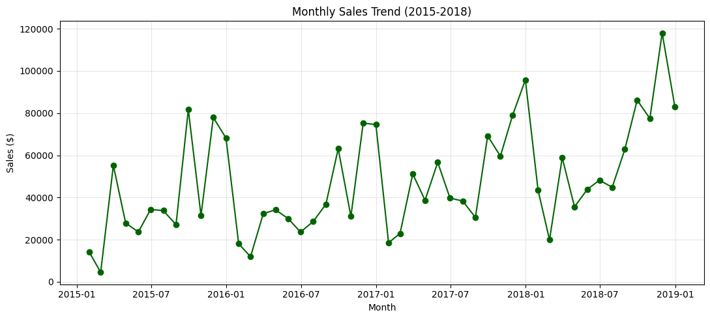
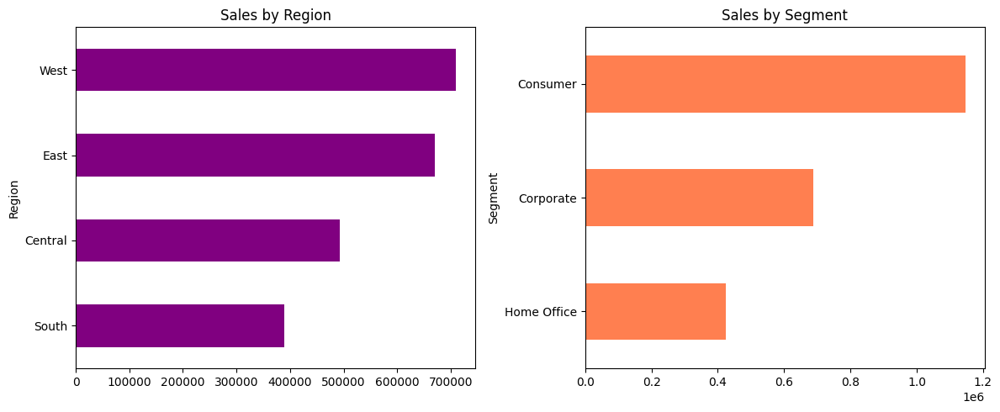
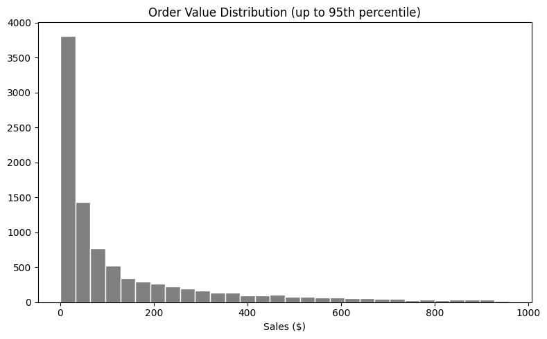

 Sales Data Analysis & Visualisation

Exploratory analysis of a retail sales dataset (9,800 orders, 18 columns, 2015-2018) using Python, Pandas and Matplotlib.

 Dataset: train.csv — https://www.kaggle.com/datasets/rohitsahoo/sales-forecasting

 Business questions
1. Which categories and sub-categories drive the most sales?
2. Which region underperforms?
3. How did sales change from 2015 to 2018, and is there seasonality?
4. Which customer segment brings the most revenue?

 Data cleaning
- Converted order and ship dates to datetime format
- Checked for duplicate rows with `df.duplicated().sum()` — none found.
- Found 11 missing postal codes, all from Burlington, Vermont; filled them with the city's correct ZIP code (05401) after confirming it manually
- Added a Year column to support the trend analysis

 Key findings
- Technology is the top-selling category, at roughly $827,000 in total sales — ahead of Furniture ($728,700) and Office Supplies ($705,400).
- Phones is the top-selling sub-category, at roughly $327,800, followed closely by Chairs at $322,800.
- Monthly sales show a rising trend from 2015 to 2018, peaking in November 2018 at close to $118,000, with a recurring pattern of stronger sales in the final quarter of each year.
- The West region leads in sales, while the South region underperforms.
- The Consumer segment brings in the most revenue, well ahead of Corporate and Home Office.

 Charts
 

 Tools
 
Python, Pandas, Matplotlib, Google Colab

 Limitations
 
The dataset has no profit column, so this analysis covers sales volume only, not profitability.
